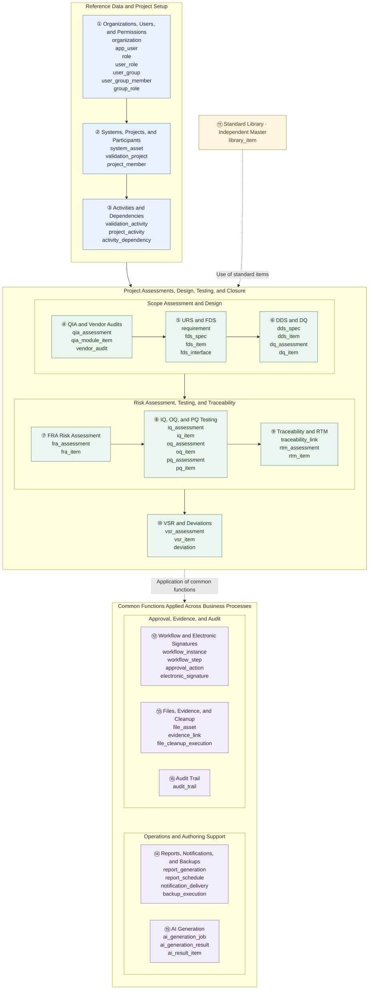

# Validation Management Platform Overall Data Structure

This diagram groups all **54 tables** into **16 business areas**. Each box lists the actual table names.

Solid lines represent organizational relationships and business flows between areas, while dotted lines represent the reuse of standard items and the application of common functions. **These lines do not represent individual table FKs or a fixed execution sequence.** For detailed columns and FKs, refer to the data dictionary.

## Overall Structure Diagram

## Key Connections

| Structure | Connection Meaning |
|---|---|
| `organization` → `system_asset` → `validation_project` | Projects are set up for systems and equipment belonging to an organization. |
| `validation_project` → `project_member` | Connects the users participating in a project with their roles. |
| `validation_project` → `project_activity` → `validation_activity` | Links the activities to be performed in a project to the activity master. |
| `validation_activity` ↔ `activity_dependency` | Defines predecessor and successor activities and activation conditions. |
| Document header → Detail items | Manages document-level information separately from item-level content, as in `fds_spec` and `fds_item`. |
| `traceability_link` → Requirements, design, risk, and test items | Manages traceability relationships between deliverables using target types and IDs. |
| `workflow_instance` → `workflow_step` → `approval_action` | Manages document-specific approval processes, individual steps, and actual action history. Action records with a signature reference `electronic_signature`. |
| `file_asset` → `evidence_link` → Business items | Links files as evidence for documents or test items. Connections to business items are managed using target types and IDs. |
| `ai_generation_job` → `ai_generation_result` → `ai_result_item` | Separates generation requests, generation results, and detailed result items. |

`library_item` is an independent master with no direct FK connections to other tables. It provides standard items for preparing URS, IQ, and OQ.

Not all tables in the common functions area are directly linked to a project. Target business data for Workflow, electronic signatures, Audit Trail, and similar functions is linked by storing the target type and ID together. `backup_execution` is an independent operational execution history.
