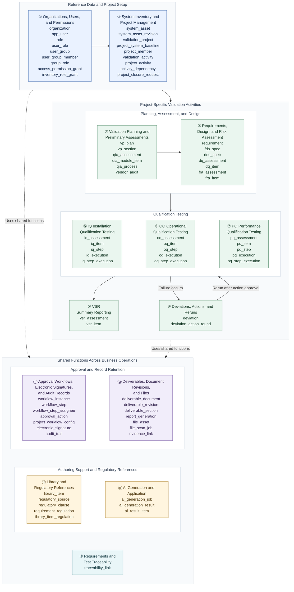

# Validation Management Platform Overall Data Structure

This diagram groups all **73 tables** into **14 business areas**. Each box lists actual table names, and each table appears only once.

The area numbers and names correspond to sections 1–14 of the [ERD Specifications](./erd-specifications.md).

Solid lines indicate composition and business flow between areas; dotted lines indicate the use of shared functions. **These lines do not represent individual table FKs or a fixed execution sequence.** The actual scope and sequence of execution follow the activities selected for the project and the applicable prerequisites and dependencies. For detailed columns and relationships, see the [Data Table Specifications](./data-dictionary.md).

## Overall Structure Diagram

```mermaid
flowchart TB
    subgraph BASE["Reference Data and Project Setup"]
        direction LR
        SECURITY["① Organizations, Users, and Permissions
organization
app_user
role
user_role
user_group
user_group_member
group_role
access_permission_grant
inventory_role_grant"]
        PROJECT["② System Inventory and<br/>Project Management
system_asset
system_asset_revision
validation_project
project_system_baseline
project_member
validation_activity
project_activity
activity_dependency
project_closure_request"]
        SECURITY --> PROJECT
    end

    subgraph VALIDATION["Project-Specific Validation Activities"]
        direction TB
        subgraph PREPARATION["Planning, Assessment, and Design"]
            direction LR
            PLANNING["③ Validation Planning and<br/>Preliminary Assessments
vp_plan
vp_section
qia_assessment
qia_module_item
qia_process
vendor_audit"]
            DESIGN["④ Requirements,<br/>Design, and Risk Assessment
requirement
fds_spec
dds_spec
dq_assessment
dq_item
fra_assessment
fra_item"]
            PLANNING --> DESIGN
        end

        subgraph TESTING["Qualification Testing"]
            direction LR
            IQ["⑤ IQ Installation<br/>Qualification Testing
iq_assessment
iq_item
iq_step
iq_execution
iq_step_execution"]
            OQ["⑥ OQ Operational<br/>Qualification Testing
oq_assessment
oq_item
oq_step
oq_execution
oq_step_execution"]
            PQ["⑦ PQ Performance<br/>Qualification Testing
pq_assessment
pq_item
pq_step
pq_execution
pq_step_execution"]
            IQ ~~~ OQ ~~~ PQ
        end

        DEVIATION["⑧ Deviations, Actions, and Reruns
deviation
deviation_action_round"]
        VSR["⑩ VSR<br/>Summary Reporting
vsr_assessment
vsr_item"]

        PREPARATION --> TESTING
        TESTING --> VSR
        TESTING -->|Failure occurs| DEVIATION
        DEVIATION -->|Rerun after action approval| TESTING
    end

    subgraph COMMON["Shared Functions Across Business Operations"]
        direction TB
        subgraph CONTROL["Approval and Record Retention"]
            direction LR
            WORKFLOW["⑪ Approval Workflows, Electronic Signatures,<br/>and Audit Records
workflow_instance
workflow_step
workflow_step_assignee
approval_action
project_workflow_config
electronic_signature
audit_trail"]
            DOCUMENTS["⑫ Deliverables, Document Revisions,<br/>and Files
deliverable_document
deliverable_revision
deliverable_section
report_generation
file_asset
file_scan_job
evidence_link"]
            WORKFLOW ~~~ DOCUMENTS
        end

        subgraph SUPPORT["Authoring Support and Regulatory References"]
            direction LR
            LIBRARY["⑬ Library and<br/>Regulatory References
library_item
regulatory_source
regulatory_clause
requirement_regulation
library_item_regulation"]
            AI["⑭ AI Generation and Application
ai_generation_job
ai_generation_result
ai_result_item"]
            LIBRARY ~~~ AI
        end

        TRACE["⑨ Requirements and<br/>Test Traceability
traceability_link"]
        CONTROL ~~~ SUPPORT
        SUPPORT ~~~ TRACE
    end

    BASE --> VALIDATION
    BASE -. Uses shared functions .-> COMMON
    VALIDATION -. Uses shared functions .-> COMMON

    classDef base fill:#eaf2ff,stroke:#5278b5,color:#172b4d
    classDef validation fill:#eaf6ef,stroke:#548c6b,color:#193c29
    classDef control fill:#f1edfa,stroke:#8569ad,color:#32224d
    classDef support fill:#fff5df,stroke:#b38a39,color:#574018
    classDef trace fill:#e9f6f8,stroke:#4f8790,color:#173d44
    class SECURITY,PROJECT base
    class PLANNING,DESIGN,IQ,OQ,PQ,DEVIATION,VSR validation
    class WORKFLOW,DOCUMENTS control
    class LIBRARY,AI support
    class TRACE trace

    style BASE fill:#f8fafc,stroke:#94a3b8,color:#334155
    style VALIDATION fill:#f8fafc,stroke:#94a3b8,color:#334155
    style PREPARATION fill:#ffffff,stroke:#cbd5e1,color:#334155
    style TESTING fill:#ffffff,stroke:#cbd5e1,color:#334155
    style COMMON fill:#f8fafc,stroke:#94a3b8,color:#334155
    style CONTROL fill:#ffffff,stroke:#cbd5e1,color:#334155
    style SUPPORT fill:#ffffff,stroke:#cbd5e1,color:#334155
```

## Key Connections

| Structure | Meaning of the Connection |
|---|---|
| `organization` → `system_asset` → `validation_project` | Validation projects are set up for systems and equipment belonging to an organization. |
| `system_asset_revision` → `project_system_baseline` | Identifies the approved system revision adopted by the project. Test executions and document revisions also link to the baseline applicable at the time, preserving historical validation targets. |
| `validation_project` → `project_member` | Manages users participating in the project and their roles. |
| `validation_project` → `project_activity` → `validation_activity` | Selects the activities to perform in the project. Prerequisites and dependencies use the criteria adopted at project creation based on `activity_dependency`. |
| `vp_plan` → `vp_section` / `qia_assessment` → `qia_module_item` → `qia_process` | Validation plans are managed as tables of contents and body sections, while quality impact assessments are divided into shared assessments, modules, and processes. Vendor audits are recorded in `vendor_audit`. |
| `requirement` · `fds_spec` · `dds_spec` → `dq_item` | Evaluates design conformity by linking specific revisions of requirements and design documents. |
| `requirement` → `fra_item` | Assesses risks for each requirement and links supporting internal SOP references through `regulatory_clause`. |
| IQ·OQ·PQ assessments → Test items and steps → Executions and step-level results | Distinguishes test content from actual execution records. The test composition of each assessment revision is preserved, and unchanged test revisions may be reused. |
| Failed execution → `deviation` → `deviation_action_round` → New execution | Manages actions and approvals for each round while preserving failure records. If a rerun fails again, the next action round is added. |
| Business results → `vsr_assessment` · `vsr_item` → Project closure decision | Consolidates results from selected execution activities and preserves supporting references as they existed at aggregation time. Project closure requests and approvals are managed separately in `project_closure_request`. |
| Requirements, designs, assessments, and tests ↔ `traceability_link` | Manages traceability relationships between specific revisions of business items. The RTM dashboard retrieves these links together with actual execution results. |
| `project_workflow_config` → `workflow_instance` → Steps, assignees, and action history | Distinguishes approval route configuration from actual workflow instances. `workflow_step` and `workflow_step_assignee` manage steps and assignees, while `approval_action` links action history and electronic signatures. |
| `deliverable_document` → `deliverable_revision` → `deliverable_section` | Separately manages deliverable identification, revisions, and tables of contents/body sections. Document revisions and the revisions/approvals of supporting business records are preserved separately. |
| User upload → `file_scan_job` → `file_asset` | Records scan attempts and results for quarantined originals, then registers file assets after the latest attempt finds no threats and identity with the original is verified. Retries are recorded as new attempts that preserve previous verdicts. |
| Business record ↔ `evidence_link` ↔ `file_asset` | Links fully registered files as evidence for tests and documents. `report_generation` manages PDF generation jobs and their result files. |
| `regulatory_source` → `regulatory_clause` → Regulatory references for requirements and library items | Distinguishes regulatory document editions from clauses and links applicability rationale through `requirement_regulation` and `library_item_regulation`. |
| `library_item` → Requirements, risk assessments, and test items | Imports reusable content and references the source library. Imported items are managed independently, and subsequent library changes are not applied automatically. |
| `ai_generation_job` → `ai_generation_result` → `ai_result_item` | Distinguishes AI generation requests, result collections, and individual drafts. After user selection and application to business records, the corresponding business review and approval procedures are followed. |

## Notes for Readers

- **RTM is a query function, not an execution stage.** It is not a mandatory stage after testing or a separate activity aggregated in the VSR.
- **Deviations branch from test failures.** After action approval, a rerun may be performed, or the deviation may be closed without a rerun by recording a reason and an electronic signature.
- **FDS and DDS are independent design documents.** They are managed together as F&DS within project activities.
- **A completed upload does not mean the file is ready for use.** User uploads may be used for attachments, downloads, or AI input only when the scan job is `COMPLETED` with `NO_THREATS_FOUND` and file asset registration is complete. Files generated internally by a trusted server are distinguished by `file_origin`; external uploaded files used in generation must first pass scanning.
- **Shared functions are used across inventory and project operations.** Not all shared tables directly reference a project. Business targets for approvals, signatures, audits, and evidence also use links combining a type and an identifier.
